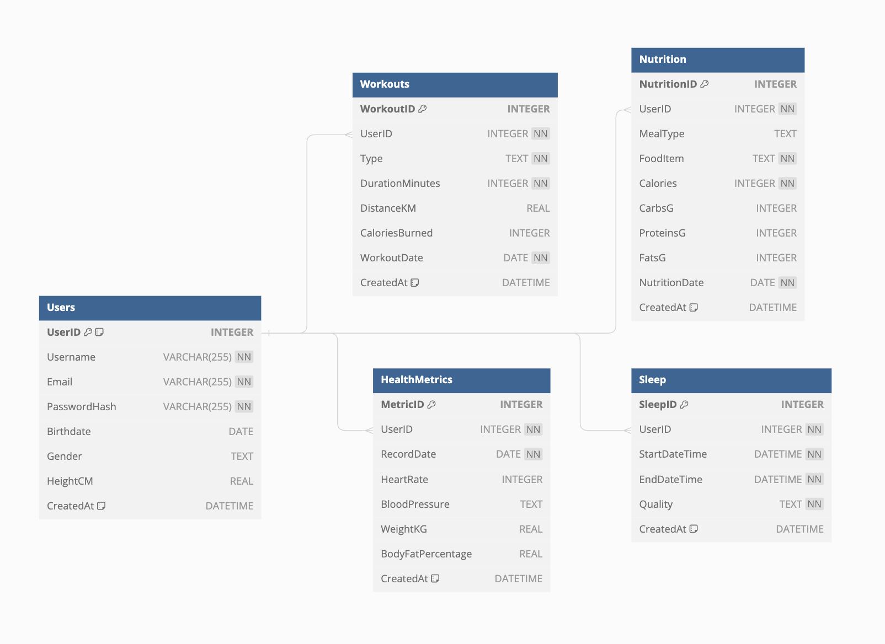

### Health and Fitness Tracking App Overview

The Health and Fitness Tracking App is designed to offer a comprehensive solution for users aiming to monitor and improve their health and fitness levels. It integrates various features to track workouts, nutrition, sleep patterns, and other health metrics, providing a holistic overview of the user's lifestyle and wellness.

The primary objective of the app is holistic health tracking. Users will be able to log and monitor various aspects of their health, including physical activity, dietary intake, sleep quality, and key health indicators.

##### Target Audience

The app targets a broad audience, ranging from fitness enthusiasts and athletes to individuals simply looking to maintain a healthy lifestyle or manage specific health conditions. It is especially beneficial for those who appreciate the convenience of having all their health-related data in one place.

##### Tracked Metrics

1. **Workouts:** Users can log various types of physical activities, including the nature of the workout (e.g., Cycling, Yoga, Weightlifting), its duration, distance covered (if applicable), and calories burned. The app also records the date and time of each workout session.
2. **Nutrition:** The app allows for detailed nutrition logging, including meal types (e.g., Breakfast, Lunch, Dinner, Snack), food items consumed, and their nutritional content (calories, carbs, proteins, fats). This helps users monitor their dietary habits and nutritional intake.
3. **Sleep:** Sleep tracking features enable users to record when they go to bed and wake up, the total duration of sleep, and the perceived quality of sleep (e.g., Poor, Average, Good). This information is crucial for understanding the impact of sleep patterns on overall health and fitness.
4. **Health Metrics:** The app provides functionality for logging key health indicators such as heart rate, blood pressure, body weight, and body fat percentage. These metrics can be tracked over time to observe trends and correlations with lifestyle habits.

##### Benefits for Users

- **Comprehensive Health Management**: By integrating various health and fitness metrics, the app provides a holistic view of the user's health, aiding in better decision-making and lifestyle adjustments.
- **Motivation and Accountability**: Tracking progress towards set goals can significantly enhance motivation. The app helps users stay accountable and encourages consistency in their health and fitness efforts.
- **Data-Driven Insights**: With detailed historical data, users can identify what works best for their health and make adjustments based on solid evidence, leading to better outcomes.

Overall, the Health and Fitness Tracking App aims to be a versatile and user-friendly platform, supporting users in their journey towards optimal health and fitness.

#### Data Requirements
Key Data Elements:
1. **User Data:**
Profile Information: Includes Username, Email, PasswordHash (for security), Birthdate, and Gender. This information is fundamental for user account management and personalization of the app experience.
Physical Attributes: Such as HeightCM, which, along with weight (tracked under health metrics), can be used to calculate body mass index (BMI) and other health-related indicators.
2. **Workout Information:**
Workout Logs: Contain details about each exercise session, including the UserID (linking the workout to a specific user), Type of workout (e.g., Cycling, Running), DurationMinutes, DistanceKM (for distance-based activities), CaloriesBurned, and WorkoutDate.
The WorkoutID serves as a unique identifier for each workout entry.
3. **Nutrition Logs:**
Dietary Entries: Track what users eat and drink, encompassing the MealType (e.g., Breakfast, Lunch), FoodItem consumed, and its nutritional content (Calories, CarbsG, ProteinsG, FatsG), along with the NutritionDate.
Each entry is linked to a UserID and uniquely identified by a NutritionID.
4. **Sleep Patterns:**
Sleep Records: Include the UserID, StartDateTime, and EndDateTime of each sleep session, along with a qualitative Quality assessment. Understanding sleep patterns is vital for assessing recovery and overall well-being.
5. **Health Metrics:**
Health Indicators: Cover crucial metrics like HeartRate, BloodPressure, WeightKG, and BodyFatPercentage, recorded on specific RecordDates. These metrics help in tracking general health status and fitness progress over time.

##### Relationships Between Data Elements:

**User-Centric Data:** Almost all data elements are tied to the UserID, emphasizing a user-centric design where each piece of information contributes to an individual's health and fitness profile. This relational approach enables personalized tracking, analysis, and recommendations.
**Temporal Data:** Many elements are time-stamped (WorkoutDate, NutritionDate, StartDateTime and EndDateTime for sleep, RecordDate for health metrics), allowing the app to present historical data, trends, and progress over time.
Moreover, such timely connection provides comprehensive health insights. For example, workout and nutrition data can be correlated to changes in health metrics like weight and body fat percentage. 

#### Database design

The database design visualization:

As I mentioned above all the tables are connected with user table to support a user-centered experience, ensuring the application can collect a comprehensive set of data to monitor and enhance users' health and fitness journeys. All the relationships are one-to-many because a single user might input multiple entries into all of the tables, allowing us to track useful data.

In addition to these aspects, it's important to consider the database normalization, creation of indices, and usage of transactions.

#### Database Normalization
The schema adheres to all normalization principles.

First Normal Form is achieved by ensuring each table column contains atomic values and by giving each table row a unique identifier, such as UserID in the Users table or WorkoutID in the Workouts table. This setup eliminates repeating groups and ensures a clear structure for storing data.

The schema moves to 2NF by ensuring that all non-key attributes are fully functional and solely dependent on the primary key. For example, all information in the Workouts table depends on WorkoutID, and any user-specific information is linked back to the Users table via UserID, avoiding partial dependency.

Lastly, the design aims to remove transitive dependencies and achieve 3NF. By segregating different data types into separate tables (Users, Workouts, Nutrition, HealthMetrics, Sleep), the schema ensures that non-key attributes in each table depend only on the primary key.

This normalization approach helps maintain data integrity and consistency while avoiding unnecessary duplication. It simplifies data management and querying, making the database more efficient and easier to maintain.

#### Indices
The index userid_workout_type on the Workouts table (UserID, Type) is created to enhance query performance. I suppose that fetching all the entries on a single workout type will be a frequent query because users would want to track their progress.

#### Transactions

Transactions are applied during user registration (users.sql) and logging nutrition entries for the entire day (nutritition.sql). They are beneficial in these contexts because they provide atomicity. For instance, wrapping user registration and initial health metrics logging in a transaction ensures that either both operations are completed successfully, or none are. This is vital because the initial health metrics are directly associated with the new user, and their relationship must be preserved without any data loss or inconsistency.

For daily nutrition entries, it's important that they are either all logged successfully or not logged at all. While not critical, the app is anticipated to support the capability of adding multiple entries simultaneously. This ensures completeness of data without the risk of loss, which could lead to potential issues down the line. For example, if an error occurs after partially adding entries, a user might attempt to re-log the entries due to the perceived failure, inadvertently creating duplicates. 

#### Execution
To execute this database, you would need the following commands:

.read db_scheme.sql
.read db_insert.sql
.read queries/user.sql
.read queries/workout.sql
.read queries/nutrition.sql
.read queries/health_metrics.sql
.read queries/sleep.sql